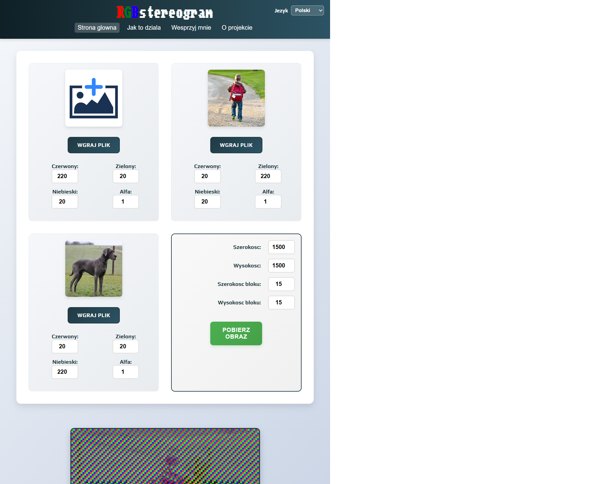

# RGBstereogram

PL i EN documentation for the project.

---

## Polski

RGBstereogram to aplikacja webowa (React + Vite), ktora laczy trzy obrazy wejsciowe w jedna kompozycje RGB i pozwala tworzyc efekty stereogramu oraz iluzje oparte na percepcji koloru.

### Dzialajaca aplikacja

Aplikacja jest dostepna online pod adresem: https://RGB.mojestrony.pl

### Screenshot aplikacji



### Najwazniejsze funkcje

- laczenie 3 obrazow do jednego obrazu wyjsciowego RGB,
- regulacja kanalow kolorow (R, G, B, Alpha),
- ustawianie wymiarow i rozmiaru bloku przetwarzania,
- podglad i pobieranie wygenerowanego obrazu,
- wielojezyczny interfejs: Polski, English, Deutsch, Espanol,
- dodatkowe podstrony informacyjne: Jak to dziala, O projekcie, Wesprzyj mnie.

### Jak to dziala

Generator mapuje dane z obrazow wejsciowych na kanaly kolorow i sklada je w jeden obraz koncowy. Przy odpowiednim oswietleniu (np. czerwonym, zielonym lub niebieskim) mozna ujawniac lub ukrywac wybrane warstwy, co daje efekt iluzji oparty na metameryzmie barw.

### Technologie

- React 18
- Vite 5
- Sass
- ESLint

### Wymagania

- Node.js 18+
- npm 9+

### Uruchomienie lokalne

1. Sklonuj repozytorium.
2. Zainstaluj zaleznosci:

```bash
npm install
```

3. Uruchom tryb developerski:

```bash
npm run dev
```

4. Otworz adres pokazany w terminalu (domyslnie: http://localhost:5173).

### Dostepne skrypty

```bash
npm run dev      # lokalny serwer deweloperski
npm run build    # build produkcyjny
npm run preview  # podglad buildu
npm run lint     # analiza kodu ESLint
```

### Struktura projektu

```text
src/
	components/
		Header.jsx
		HomePage.jsx
		InputImages.jsx
		OutputImage.jsx
		HowItWorks.jsx
		AboutProject.jsx
		SupportMe.jsx
		Footer.jsx
	App.jsx
	i18n.js
	index.scss
	main.jsx
```

### Linki

- Dzialajaca aplikacja: https://RGB.mojestrony.pl
- Repozytorium GitHub: https://github.com/lukKotecki/RGBstereogram
- Wsparcie projektu (PayPal): https://paypal.me/lukkotecki

### Licencja

Brak zdefiniowanej licencji w repozytorium. Jesli chcesz udostepniac projekt publicznie, warto dodac plik LICENSE.

---

## English

RGBstereogram is a web application (React + Vite) that combines three input images into a single RGB composition and enables stereogram-like visuals based on color perception.

### Live app

The application is available online at: https://RGB.mojestrony.pl

### Application screenshot


### Key features

- merge 3 source images into one RGB output image,
- adjust color channels (R, G, B, Alpha),
- set output dimensions and processing chunk size,
- preview and download the generated image,
- multilingual interface: Polish, English, German, Spanish,
- extra information pages: How it works, About the project, Support me.

### How it works

The generator maps pixel data from source images into color channels and composes a final image. Under selected lighting (for example red, green, or blue), specific layers can be revealed or hidden, creating an illusion effect related to color metamerism.

### Tech stack

- React 18
- Vite 5
- Sass
- ESLint

### Requirements

- Node.js 18+
- npm 9+

### Local setup

1. Clone the repository.
2. Install dependencies:

```bash
npm install
```

3. Start development server:

```bash
npm run dev
```

4. Open the URL shown in the terminal (default: http://localhost:5173).

### Available scripts

```bash
npm run dev      # development server
npm run build    # production build
npm run preview  # preview production build
npm run lint     # run ESLint
```

### Project structure

```text
src/
	components/
		Header.jsx
		HomePage.jsx
		InputImages.jsx
		OutputImage.jsx
		HowItWorks.jsx
		AboutProject.jsx
		SupportMe.jsx
		Footer.jsx
	App.jsx
	i18n.js
	index.scss
	main.jsx
```

### Links

- Live app: https://RGB.mojestrony.pl
- GitHub repository: https://github.com/lukKotecki/RGBstereogram
- Project support (PayPal): https://paypal.me/lukkotecki

### License

No license file is currently defined in the repository. If you plan to distribute the project publicly, consider adding a LICENSE file.